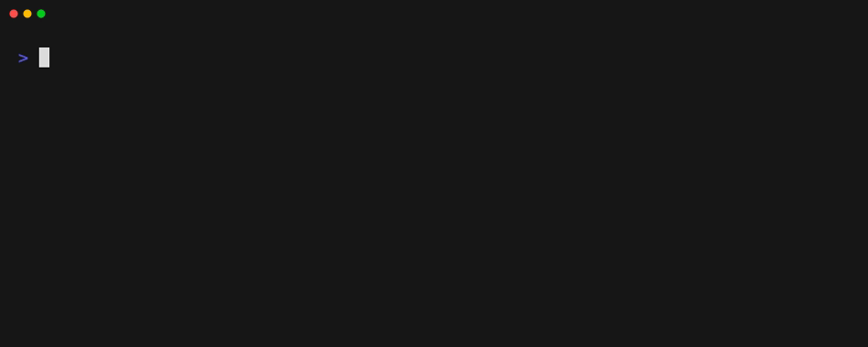

# OKF Graph

Explore and validate [Open Knowledge Format (OKF)](https://github.com/GoogleCloudPlatform/open-knowledge-format/blob/main/SPEC.md) bundles from your terminal.

[](https://www.npmjs.com/package/okf-graph)

`okf-graph` turns the Markdown links in an OKF bundle into a directed graph. Use it to find broken links, inspect individual concepts, explore relationships, and understand the structure of a knowledge bundle.



## Quick start

Install [Bun](https://bun.sh) first. The examples use `npx` to run the latest published version without installing it globally.

```bash
npx okf-graph@latest graph neighbors \
  https://github.com/lloydrichards/proj_okf-graph/tree/main/examples/house-plants-okf \
  propagation/leaf-cuttings
```

An OKF bundle, like the included [`house-plants-okf`](./examples/house-plants-okf), is a directory of Markdown concept files with YAML frontmatter. Links between those files express relationships as a directed graph.

## Explore a bundle

```bash
# Use the example bundle for the commands below
BUNDLE="https://github.com/lloydrichards/proj_okf-graph/tree/main/examples/house-plants-okf"

# Read a concept and explore its local graph interactively
npx okf-graph@latest concept "$BUNDLE" foundations/houseplant --interactive

# Print a concept's neighbors directly
npx okf-graph@latest graph neighbors "$BUNDLE" foundations/houseplant

# Validate the structure and links in your own bundle
npx okf-graph@latest validate path/to/your-bundle
```

`foundations/houseplant` is a concept ID: the path to its Markdown file inside the bundle, without the `.md` extension. Run `npx okf-graph@latest --help` to discover commands, then `npx okf-graph@latest <command> --help` for options such as machine-readable JSON output.

## Install globally

Install the command if you use it regularly:

```bash
npm install --global okf-graph
okf-graph --help
```

Commands accept local directories and GitHub tree URLs like the example above.

## Learn more

- [okf-graph on npm](https://www.npmjs.com/package/okf-graph)
- [Open Knowledge Format specification](https://github.com/GoogleCloudPlatform/open-knowledge-format/blob/main/SPEC.md)
- [Open Knowledge Format on GitHub](https://github.com/GoogleCloudPlatform/open-knowledge-format)
- [edu_effect-okf](https://github.com/lloydrichards/edu_effect-okf), the learning project that preceded this CLI

## Development

Clone the repository, install dependencies with Bun, and run the CLI from the repository root:

```bash
bun install
bun start -- --help
bun start -- graph path examples/house-plants-okf foundations/houseplant care/watering
bun test
```

The repository includes [`examples/house-plants-okf`](./examples/house-plants-okf), a sample bundle for local exploration.

## Explore other OKF bundles

The official Open Knowledge Format repository includes several OKF v0.2 bundles covering different domains and graph shapes:

- [GA4](https://github.com/GoogleCloudPlatform/open-knowledge-format/tree/main/bundles/ga4) — Google Analytics e-commerce data, events, and metrics.
- [Stack Overflow](https://github.com/GoogleCloudPlatform/open-knowledge-format/tree/main/bundles/stackoverflow) — a larger, densely connected public dataset.
- [Bitcoin](https://github.com/GoogleCloudPlatform/open-knowledge-format/tree/main/bundles/crypto_bitcoin) — blocks, transactions, inputs, and outputs.
- [Acme Retail](https://github.com/GoogleCloudPlatform/open-knowledge-format/tree/main/bundles/acme_retail) — metrics, policies, attested computations, and bundle history.

Pass any bundle URL directly to `okf-graph`:

```bash
npx okf-graph@latest validate \
  https://github.com/GoogleCloudPlatform/open-knowledge-format/tree/main/bundles/acme_retail
```

## License

[MIT](LICENSE)
